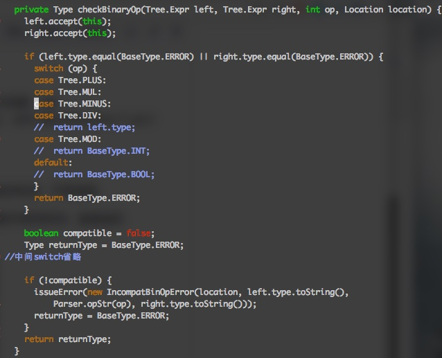
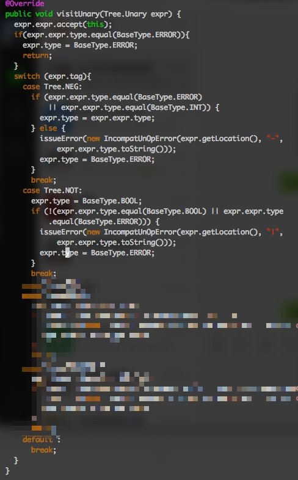
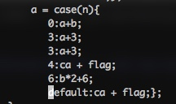

关于runall脚本的问题：   
Yuhui 助教您好，这次作业的runall.py在macos上无法正常运行，经过检查发现在runall.py代码里：
def read_txt_file(filename):
    with open(filename,'a+') as f:
需要改为
def read_txt_file(filename):
    with open(filename,'r') as f:
另外，如果python3报错，请将两行print语句注释掉 

1\. 关于出错返回的问题：

单目运算符和双目运算符发生无法运算的情况即返回ERROR。

操作数中含有Error，直接返回ERROR，不再报错。

关于ERROR的判断和返回，在checkBinaryOp和visitUnary函数的开始加入判断，发现操作数中有ERROR，直接返回ERROR。

2\. 关于Complex 比较问题

complex 只支持+ 和\*运算，其余的操作都不支持

3\. case 的类型

case的类型以default 为准。 

违反README中四条要求任意一条都会返回ERROR。 

如果E是ERROR，case的类型不是ERROR。

default 为ERROR时，case的type也为ERROR.此时Ci和Ei的分析不能停。 

如果Ci和Ei是ERROR，则相应的在case中不再报错。

如下代码应报错为：

4\. super 的类型判断。

super 只有在负责调用时是父类，其余时候均是当做类似this的存在。super支持赋值运算。

super进行函数调用时找不到相应的函数，报直接父类的错误。

5\. Do test2 中有一处typo将request写成了requestd。维持这个错误即可。
