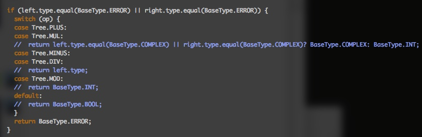
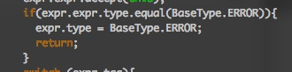

1\. 关于出错返回的问题：

单目运算符和双目运算符发生无法运算的情况即返回ERROR。操作数中含有Error，直接返回ERROR，不再报错。

关于ERROR的判断和返回，在checkBinaryOp和visitUnary函数的前面加入判断，发现操作数中有ERROR，直接返回ERROR。

2\. 关于Complex 比较问题

complex 只支持+ 和\*运算，其余的操作都不支持

3\. case 的类型

case的类型以default 为准。 

违反README中三条要求任意一条都会返回ERROR 

default 为ERROR时，case的type也为ERROR.此时Ci和Ei的分析不能停。 

如果Ci和Ei是ERROR，则相应的在case中不再报错。

如下代码应报错为：

4\. super 的类型判断。

super 只有在负责调用时是父类，其余时候均是当做类似this的存在。

